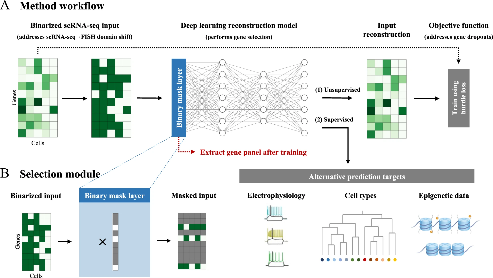

# Gene Set Selection with PERSIST

# PERSIST Method

[PERSIST](https://www.nature.com/articles/s41467-023-37392-1) is a deep learning based method that selects a small panel of genes that can optimally reconstruct the entire scRNA-seq expression profile. Details on the method is shown below:

:::{#PERSIST-Figures}

{#fig:persist-method}

:::

Briefly, it's a autoencoder framework with a learnable sparsity pattern. This sparsity pattern can be enforced with a binary mask/gate layer specified by the binary concrete distribution. The binary mask/gate layer is then used to sparsify the weights of the autoencoder. The sparsified autoencoder is then used to reconstruct the input data. The genes that are used to reconstruct the input data are then selected as the gene set.

From github copilot: 
The binary concrete distribution is a continuous relaxation of the binary distribution. The binary concrete distribution is parameterized by a temperature parameter, which can be annealed during training. The binary concrete distribution is then used to sample the binary mask/gate layer. 
    

# Introduction

Previously, in `gene_sets.qmd` we generated subsetted H5AD files for different gene sets. We will use these H5AD files to train supervised prediction models.

No we are going to train some random forest models on this data for supervised cell type prediction. 
We will be training models and evaluating their performance on these different datasets and see which gene set is best.

As a reminder, the gene sets are organized by the following categories, updated prices from 10x genomics (cost per rxn) are shown below:

*   [Xenium brain tumor panel](https://www.10xgenomics.com/products/xenium-panels#pre-designed-panels) -- $172.50
*   Xenium brain tumor panel + 100 PERSIST genes -- $172.50 + $1412.50
*   Xenium brain tumor panel + 100 scanpy `highly_variable_genes` genes -- $172.50 + $1412.50
*   [Xenium custom panels](https://www.10xgenomics.com/products/xenium-panels#custom-panels) -- up to 480 genes PERSIST genes -- $1818.75 - $4462.50
*   Xenium custom panels -- up to 480 genes scanpy `highly_variable_genes` genes -- $1818.75 - $4462.50


```{python}
import scanpy as sc
import pandas as pd
import numpy as np
import anndata as ad
import os
import joblib
from sklearn.model_selection import GridSearchCV
from sklearn.model_selection import train_test_split
from sklearn.ensemble import RandomForestClassifier
from sklearn.metrics import f1_score
from sklearn.metrics import confusion_matrix
# setting my own working directory, feel free to change it to your own
# local vs UGER
if os.path.expanduser('~') in ["/Users/youyun", "/Users/youyunzheng"]: 
    # in a local mac, the home directory is usuaully at '/Users/[username]'
    workdir = os.path.expanduser('~')+"/Documents/HMS/PhD/beroukhimlab/broad_mount/"
else:
    # in dipg or uger, the home directory is usuaully at '/home/unix/[username]'
    workdir = "/xchip/beroukhimlab/"
```

Files are here:

```{python}
output_dir = workdir + 'youyun/plgg/data/xenium_selection/'
print('The H5AD files are here: ' + output_dir)
# sc_adata_dir = output_dir + 'sc_adata_processed_with_annotation.h5ad'
sc_adata_1_dir = output_dir + 'sc_adata_1.h5ad'
sc_adata_2_dir = output_dir + 'sc_adata_2.h5ad'
sc_adata_3_dir = output_dir + 'sc_adata_3.h5ad'
sc_adata_4_dir = output_dir + 'sc_adata_4.h5ad'
sc_adata_5_dir = output_dir + 'sc_adata_5.h5ad'

# sc_adata = sc.read_h5ad(sc_adata_dir)
sc_adata_1 = sc.read_h5ad(sc_adata_1_dir)
sc_adata_2 = sc.read_h5ad(sc_adata_2_dir)
sc_adata_3 = sc.read_h5ad(sc_adata_3_dir)
sc_adata_4 = sc.read_h5ad(sc_adata_4_dir)
sc_adata_5 = sc.read_h5ad(sc_adata_5_dir)
```

# Inspecting the datasets

Looking at the dimensionality of the datasets -- number of cells, number of genes, train test splits

```{python}
# making a tabulated data with gene expression and cell type labels
def make_tabulated_data(adata):
    # making a tabulated data with gene expression and cell type labels
    tabulated_data = pd.DataFrame(adata.X.toarray(), columns=adata.var_names, index=adata.obs_names)
    tabulated_data['cell_type'] = adata.obs['cell_label']
    return tabulated_data

# making tabulated data
# sc_adata_tabulated = make_tabulated_data(sc_adata)
sc_adata_1_tabulated = make_tabulated_data(sc_adata_1)
sc_adata_2_tabulated = make_tabulated_data(sc_adata_2)
sc_adata_3_tabulated = make_tabulated_data(sc_adata_3)
sc_adata_4_tabulated = make_tabulated_data(sc_adata_4)
sc_adata_5_tabulated = make_tabulated_data(sc_adata_5)
print(
    'Dimensions of each dataset: \n' +
    # 'sc_adata: ' + str(sc_adata_tabulated.shape) + '\n' +
    'sc_adata_1: ' + str(sc_adata_1_tabulated.shape) + '\n' +
    'sc_adata_2: ' + str(sc_adata_2_tabulated.shape) + '\n' +
    'sc_adata_3: ' + str(sc_adata_3_tabulated.shape) + '\n' +
    'sc_adata_4: ' + str(sc_adata_4_tabulated.shape) + '\n' +
    'sc_adata_5: ' + str(sc_adata_5_tabulated.shape) + '\n'
)
print(
    'Cell type breakdown here: \n' +
    str(sc_adata_1_tabulated['cell_type'].value_counts())
)
```

We can see the number of genes in each dataset is slightly different. And it seems like all cell types are relatively well represented except for the `endothelial` cells. We will need to be careful about this when we are training the models.

```{python}
# train test split
# Xf_train, Xf_test, yf_train, yf_test = train_test_split(
#     sc_adata_tabulated.iloc[:, :-1], 
#     sc_adata_tabulated.iloc[:, -1], 
#     test_size=0.33, 
#     stratify=sc_adata_tabulated.iloc[:, -1],
#     random_state=55555
# )
X1_train, X1_test, y1_train, y1_test = train_test_split(
    sc_adata_1_tabulated.iloc[:, :-1], 
    sc_adata_1_tabulated.iloc[:, -1], 
    test_size=0.33, 
    stratify=sc_adata_1_tabulated.iloc[:, -1],
    random_state=55555
)
X2_train, X2_test, y2_train, y2_test = train_test_split(
    sc_adata_2_tabulated.iloc[:, :-1], 
    sc_adata_2_tabulated.iloc[:, -1], 
    test_size=0.33, 
    stratify=sc_adata_2_tabulated.iloc[:, -1],
    random_state=55555
)
X3_train, X3_test, y3_train, y3_test = train_test_split(
    sc_adata_3_tabulated.iloc[:, :-1], 
    sc_adata_3_tabulated.iloc[:, -1], 
    test_size=0.33, 
    stratify=sc_adata_3_tabulated.iloc[:, -1],
    random_state=55555
)
X4_train, X4_test, y4_train, y4_test = train_test_split(
    sc_adata_4_tabulated.iloc[:, :-1], 
    sc_adata_4_tabulated.iloc[:, -1], 
    test_size=0.33, 
    stratify=sc_adata_4_tabulated.iloc[:, -1],
    random_state=55555
)
X5_train, X5_test, y5_train, y5_test = train_test_split(
    sc_adata_5_tabulated.iloc[:, :-1], 
    sc_adata_5_tabulated.iloc[:, -1], 
    test_size=0.33, 
    stratify=sc_adata_5_tabulated.iloc[:, -1],
    random_state=55555
)
print(
    'The training set and test set dimensions: \n' +
    'training: ' + str(X1_train.shape[0]) + ' ' + 
    'testing: ' + str(X1_test.shape[0]) + '\n' 
)
print(
    'The training and test set class breakdown: \n' +
    'training: \n' +
    str(y1_train.value_counts()) + '\n' +
    'testing: \n' +
    str(y1_test.value_counts()) + '\n'
)
```

# Training Supervised Prediction Models to On Different Gene Sets

Here we are doing 5-fold cross validation to train the models. We will be using the `RandomForestClassifier` from `sklearn` to train the models. We will be using `GridSearchCV` to find the best hyperparameters for the models.

```{python}
#| eval: false
# train models using gridsearchCV
def train_models_gridsearchCV(X_train, y_train, X_test, y_test):
    # train models using gridsearchCV
    rf = RandomForestClassifier(random_state=55555)
    param_grid = {
        'n_estimators': [100, 300, 500],
        'max_depth' : [4,8,32]
    }
    grid_search = GridSearchCV(estimator=rf, param_grid=param_grid, cv=5, n_jobs=-1, verbose=2)
    grid_search.fit(X_train, y_train)
    y_pred = grid_search.predict(X_test)
    return grid_search, y_pred

# train models based on macroaveraging
def train_models(X_train, y_train, X_test, y_test):
    # train models based on macroaveraging
    rf = RandomForestClassifier(n_estimators=100, random_state=55555)
    rf.fit(X_train, y_train)
    y_pred = rf.predict(X_test)
    return rf, y_pred
# rff, yf_pred = train_models(Xf_train, yf_train, Xf_test, yf_test)
rf1, y1_pred = train_models_gridsearchCV(X1_train, y1_train, X1_test, y1_test)
rf2, y2_pred = train_models_gridsearchCV(X2_train, y2_train, X2_test, y2_test)
rf3, y3_pred = train_models_gridsearchCV(X3_train, y3_train, X3_test, y3_test)
rf4, y4_pred = train_models_gridsearchCV(X4_train, y4_train, X4_test, y4_test)
rf5, y5_pred = train_models_gridsearchCV(X5_train, y5_train, X5_test, y5_test)
# save the models
# joblib.dump(rff, 'rff.pkl')
joblib.dump(rf1, output_dir + 'rf1.pkl')
joblib.dump(rf2, output_dir + 'rf2.pkl')
joblib.dump(rf3, output_dir + 'rf3.pkl')
joblib.dump(rf4, output_dir + 'rf4.pkl')
joblib.dump(rf5, output_dir + 'rf5.pkl')
```

```{python}
#| results: hold
rf1 = joblib.load(output_dir + 'rf1.pkl')
rf2 = joblib.load(output_dir + 'rf2.pkl')
rf3 = joblib.load(output_dir + 'rf3.pkl')
rf4 = joblib.load(output_dir + 'rf4.pkl')
rf5 = joblib.load(output_dir + 'rf5.pkl')
```

## Looking at the best hyperparameters of the models

```{python}
# what are the best params:
print(
    'Best params for each model: \n' +
    'Gene set 1: ' + str(rf1.best_params_) + '\n' +
    'Gene set 2: ' + str(rf2.best_params_) + '\n' +
    'Gene set 3: ' + str(rf3.best_params_) + '\n' +
    'Gene set 4: ' + str(rf4.best_params_) + '\n' +
    'Gene set 5: ' + str(rf5.best_params_) + '\n'
)
```

# Evaluating the performance of the models on the train and test set

## training set

We look at both the macro-weighted F1-score, and the accuracy of the models on the training set.

```{python}
#| results: hold
# performance metrics
# f1 score train set
print(
    'F1 macroaveraging on train set: \n' +
    # 'F1 score for sc_adata: ' + str(f1_score(yf_train, rff.predict(Xf_train), average='macro')) + '\n' +
    'F1 score for sc_adata_1: ' + str(f1_score(y1_train, rf1.predict(X1_train[rf1.best_estimator_.feature_names_in_]), average='macro')) + '\n' +
    'F1 score for sc_adata_2: ' + str(f1_score(y2_train, rf2.predict(X2_train[rf2.best_estimator_.feature_names_in_]), average='macro')) + '\n' +
    'F1 score for sc_adata_3: ' + str(f1_score(y3_train, rf3.predict(X3_train[rf3.best_estimator_.feature_names_in_]), average='macro')) + '\n' +
    'F1 score for sc_adata_4: ' + str(f1_score(y4_train, rf4.predict(X4_train[rf4.best_estimator_.feature_names_in_]), average='macro')) + '\n' +
    'F1 score for sc_adata_5: ' + str(f1_score(y5_train, rf5.predict(X5_train[rf5.best_estimator_.feature_names_in_]), average='macro')) + '\n'
)
# accuracy
print(
    'Train Set accuracy: \n' +
    # 'Accuracy for sc_adata: ' + str(np.mean(yf_train == rff.predict(Xf_train))) + '\n' +
    'Accuracy for sc_adata_1: ' + str(np.mean(y1_train == rf1.predict(X1_train[rf1.best_estimator_.feature_names_in_]))) + '\n' +
    'Accuracy for sc_adata_2: ' + str(np.mean(y2_train == rf2.predict(X2_train[rf2.best_estimator_.feature_names_in_]))) + '\n' +
    'Accuracy for sc_adata_3: ' + str(np.mean(y3_train == rf3.predict(X3_train[rf3.best_estimator_.feature_names_in_]))) + '\n' +
    'Accuracy for sc_adata_4: ' + str(np.mean(y4_train == rf4.predict(X4_train[rf4.best_estimator_.feature_names_in_]))) + '\n' +
    'Accuracy for sc_adata_5: ' + str(np.mean(y5_train == rf5.predict(X5_train[rf5.best_estimator_.feature_names_in_]))) + '\n'
)
```

## test set

```{python}
#| results: hold
y1_pred = rf1.predict(X1_test[rf1.best_estimator_.feature_names_in_])
y2_pred = rf2.predict(X2_test[rf2.best_estimator_.feature_names_in_])
y3_pred = rf3.predict(X3_test[rf3.best_estimator_.feature_names_in_])
y4_pred = rf4.predict(X4_test[rf4.best_estimator_.feature_names_in_])
y5_pred = rf5.predict(X5_test[rf5.best_estimator_.feature_names_in_])
# f1 score test set
print(
    'F1 macroaveraging on test set: \n' +
    # 'F1 score for sc_adata: ' + str(f1_score(yf_test, yf_pred, average='macro')) + '\n' +
    'F1 score for sc_adata_1: ' + str(f1_score(y1_test, y1_pred, average='macro')) + '\n' +
    'F1 score for sc_adata_2: ' + str(f1_score(y2_test, y2_pred, average='macro')) + '\n' +
    'F1 score for sc_adata_3: ' + str(f1_score(y3_test, y3_pred, average='macro')) + '\n' +
    'F1 score for sc_adata_4: ' + str(f1_score(y4_test, y4_pred, average='macro')) + '\n' +
    'F1 score for sc_adata_5: ' + str(f1_score(y5_test, y5_pred, average='macro')) + '\n'
)
# accuracy
print(
    'Test Set accuracy: \n' +
    # 'Accuracy for sc_adata: ' + str(np.mean(yf_test == yf_pred)) + '\n' +
    'Accuracy for sc_adata_1: ' + str(np.mean(y1_test == y1_pred)) + '\n' +
    'Accuracy for sc_adata_2: ' + str(np.mean(y2_test == y2_pred)) + '\n' +
    'Accuracy for sc_adata_3: ' + str(np.mean(y3_test == y3_pred)) + '\n' +
    'Accuracy for sc_adata_4: ' + str(np.mean(y4_test == y4_pred)) + '\n' +
    'Accuracy for sc_adata_5: ' + str(np.mean(y5_test == y5_pred)) + '\n'
)
```

## Visualizations of the confusion matrix

```{python}
# plot all the confusion matrix together
import matplotlib.pyplot as plt
import seaborn as sns
labels = list(set(y1_test))
labels.sort()
fig, axs = plt.subplots(3, 2, figsize=(12, 12))
fig.tight_layout(h_pad=6, w_pad=6)
sns.heatmap(confusion_matrix(y1_test, y1_pred), ax=axs[0, 0], annot=True, fmt='d')
axs[0, 0].xaxis.set_ticklabels(labels, rotation=30)
axs[0, 0].yaxis.set_ticklabels(labels, rotation=0)
axs[0, 0].set_title('Gene set 1')
sns.heatmap(confusion_matrix(y2_test, y2_pred), ax=axs[0, 1], annot=True, fmt='d')
axs[0, 1].xaxis.set_ticklabels(labels, rotation=30)
axs[0, 1].yaxis.set_ticklabels(labels, rotation=0)
axs[0, 1].set_title('Gene set 2')
sns.heatmap(confusion_matrix(y3_test, y3_pred), ax=axs[1, 0], annot=True, fmt='d')
axs[1, 0].xaxis.set_ticklabels(labels, rotation=30)
axs[1, 0].yaxis.set_ticklabels(labels, rotation=0)
axs[1, 0].set_title('Gene set 3')
sns.heatmap(confusion_matrix(y4_test, y4_pred), ax=axs[1, 1], annot=True, fmt='d')
axs[1, 1].xaxis.set_ticklabels(labels, rotation=30)
axs[1, 1].yaxis.set_ticklabels(labels, rotation=0)
axs[1, 1].set_title('Gene set 4')
sns.heatmap(confusion_matrix(y5_test, y5_pred), ax=axs[2, 0], annot=True, fmt='d')
axs[2, 0].xaxis.set_ticklabels(labels, rotation=30)
axs[2, 0].yaxis.set_ticklabels(labels, rotation=0)
axs[2, 0].set_title('Gene set 5')
# sns.heatmap(confusion_matrix(yf_test, yf_pred), ax=axs[2, 1], annot=True, fmt='d')
# axs[2, 1].set_title('sc_adata')
plt.show()
```

